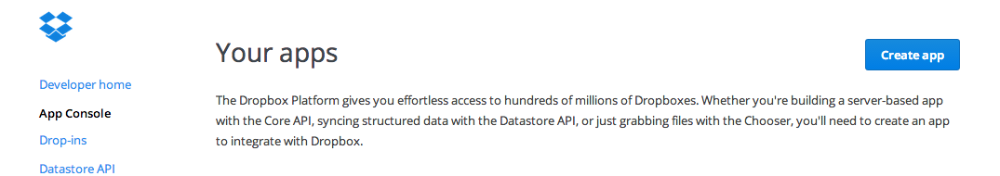
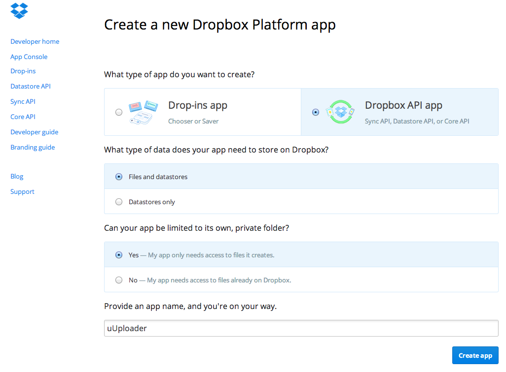
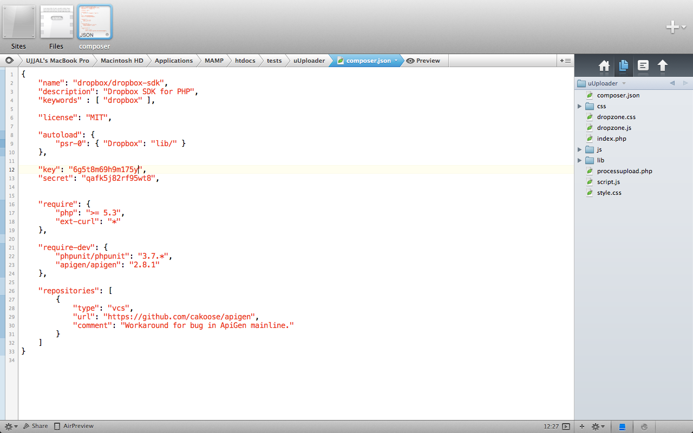
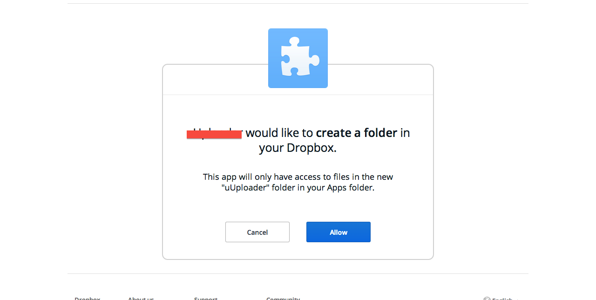
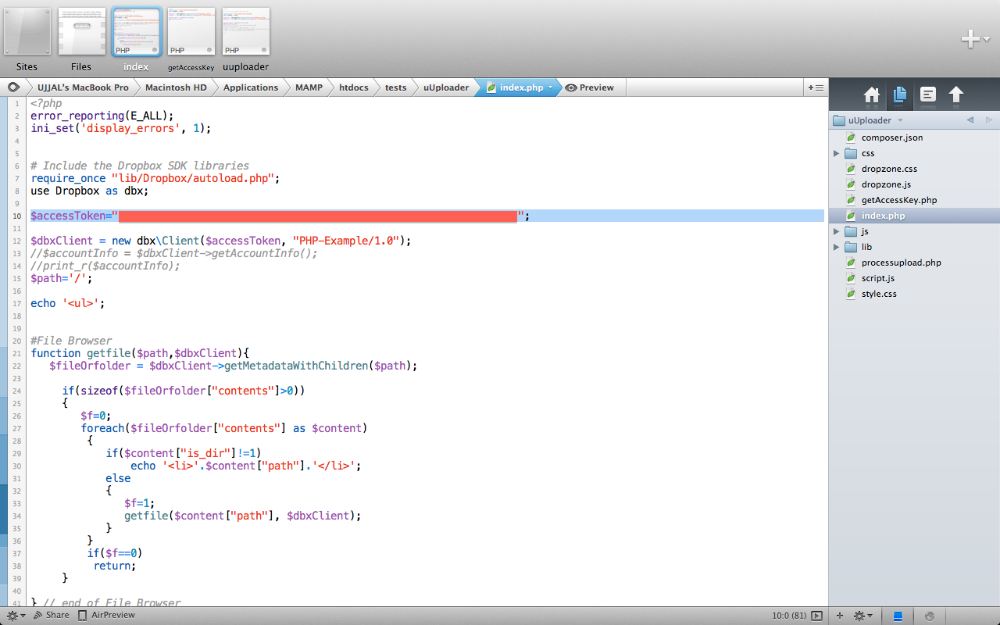
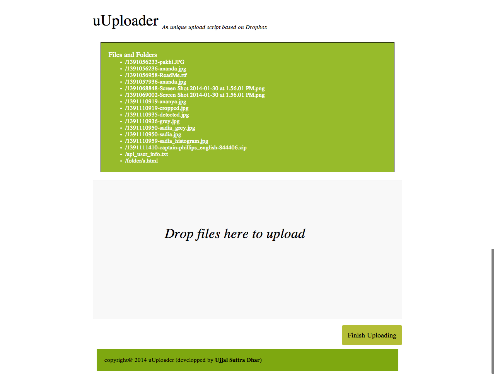

###What is it?
UploaDrop is a dropbox based upload script which is used for uploading files and folders to dropbox instead of server storage.

###Motivation
Most of the time, we, the developers, must have to manipulate large files on the website like videos, audios or other documents. If the unit size of files is small, then its okey. There is no big deal to handle these files of small size. But when the application requires to upload files of large size like 5GB on each upload, we need to consider the reliablity of the upload script. We need to consider the maximum size of files which can be uploaded. We need to consider the maximum bandwidth we can use at a time. We have to take the burden of server optimization.

To get rid of these headache, we can handle this file manipulation tasks to other 3rd party who is already established with the service of file manipulation.

Dropbox is cloud based file hosting server in which users can upload their files and can download when needed. Dropbox has provided lots of features including large file uploading with optimized way.

Dropbox has also provided an api which is highly user-friendly so that any developer can use that.

###Objective
To develop a script in which visitors/users of the application can upload file via drag drop or choosing. Instead of the hosting space, these files will be uploaded on dropbox space of the owner of the application. Then these files can be used for different purposes.

###Features
1. Multiple files uploading at a time
2. File uploading to owner's dropbox storage
3. No need to have headache about file manipulation, storage, bandwidth of file uploading.
4. Recrsively finds every files from all folders and uploads to dropbox

###Acknowledgements
First of all I would like to thank the Dropbox Team for providing this awesome service.

Then I thank Mr. Nuhil Mehdy (nuhil.net) to give me the idea. 

Lets start the development of an simple application called UploaDrop by which end user will upload something to your website, and instead of your host, it will be uploaded on dropbox.

###When you are a Developer
The first task is to create an app on your Dropbox account using developer account.

1. Go to https://www.dropbox.com/developers/apps and Click on "Create app" button.
   

2. Fill these given fields as the picture shows.
   

3. After completing the creation of your app you will see the details of your app by going https://www.dropbox.com/developers/apps and click on the App Name 'UploaDrop'. 
   

See the rounded area which provides app key and app secret. These two key defines the access of your dropbox account for uploading from outside.

4. Now open composer.json for editing and set these keys on this like the picture shows.
   

5. OK, In this step you are all set. Now lets get the access key. Execute getAccesskey.php on the browser which returns a url like
https://www.dropbox.com/1/oauth2/authorize?locale=&client_id=12ab34vd&response_type=code

6. Copy this url and paste on the browser. It will ask for permission to create a folder named app name on the dropbox account.
   
Click on "Allow"

7. An access key will be displayed like the given screenshot.
   
Save the Access key on some secured place.

8. Open index.php and and edit the $accesskey field on line 10.
   
  
   Open processupload.php and do the same task on line 5.   

Here, developer's work is finished. All configuration is finished.

###Front End behavior
1. Hit "index.php" on the browser, the front end page will be arrived. 
   
2. In the drag&drop area, user can drag&drop their files and folders. A progress bar will be shown for each of the files when uploading. After completation of uploading of all files click on "Finish Uploading". 

This is the simple app. Actually, It is a brief instruction of how to use Dropbox Core Api. 

###Future Works:
1. In the top area, all existing files are being displayed in recursive structure which is coded by me. In dropbox core api, there are options to create download link of each files, Editing, Deleting etc. These 3 features can be achieved in future. 
 
2. If any compressed file is drop on the drag&drop area, it doesnt extract the compressed file. In future, it can be an issue.

###Used Tools
1. [Dropzone.js](http://www.dropzonejs.com) for Drag and Drop
2. [Dropbox Api](https://www.dropbox.com/developers)
3. Netbeans IDE as Editor
4. OS X 10.8.5 as OS 
